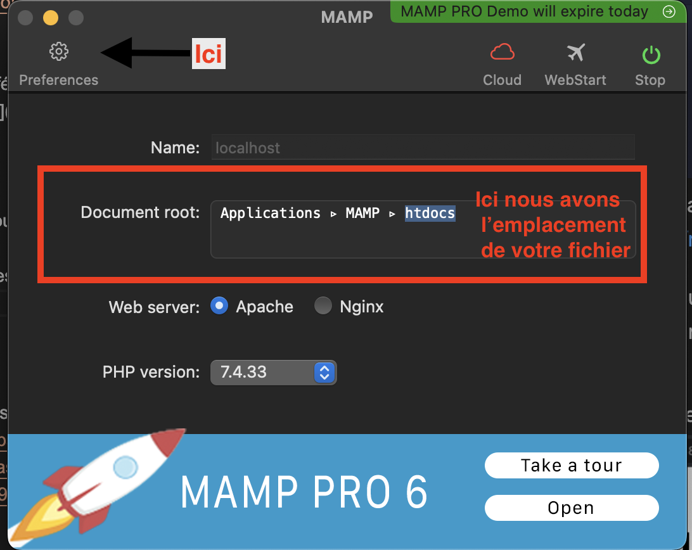
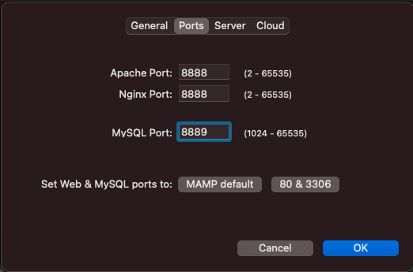
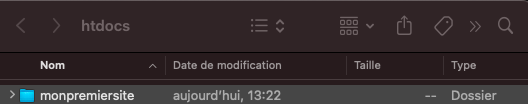
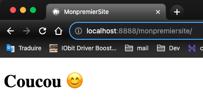

# HTML intégration

[Voir Github Version](https://github.com/Poulycroc/lessons-isfsc/blob/master/courses/02__html-integration.md)

## Le but ?
PHP (acronyme de "PHP : Hypertext Preprocessor") est un langage de programmation côté serveur principalement utilisé pour développer des sites web dynamiques. Il s'exécute sur le serveur et permet de générer du contenu HTML, qui est ensuite envoyé au navigateur de l'utilisateur.

Le PHP est particulièrement utile pour gérer les données stockées dans une base de données, pour gérer les sessions utilisateur, pour créer des formulaires et pour gérer les données soumises par l'intermédiaire de ces formulaires. Il permet également de créer des scripts pour envoyer des emails automatisés, de gérer les fichiers sur le serveur et de créer du contenu dynamique en fonction des actions des utilisateurs.

En résumé, le PHP est un outil très utile pour développer des sites web interactifs et dynamiques, en permettant de créer du contenu personnalisé en fonction des actions des utilisateurs et de gérer les données stockées sur le serveur.


## MAMP ?
Pour lire des fichiers `fichier.php` nous allons avoir besoin d'un serveur php de type [Apache](https://fr.wikipedia.org/wiki/Apache_HTTP_Server), nous allons pour ça utiliser MAMP


<details>
<summary>Téléchargement</summary>

##### Se rendre sur [https://www.mamp.info/en/downloads/](https://www.mamp.info/en/downloads/)


#### Mac

##### si vous êtes sur M1 / M2 
Prendre 'MAMP & MAMP PRO 6.6 (M1)'

##### si vous êtes sur Intel
Prendre 'MAMP & MAMP PRO 6.6 (Intel)'

> [!Attention]
> Si vous ne savez pas : rendez-vous dans le menu "Pomme", puis sélectionnez "À propos de ce Mac", et regardez la section "Processeur".

#### Windows
prendre 'MAMP & MAMP PRO 5.0.5'
</details>
<details>
<summary>Utilisation</summary>
#### À quoi cela resemble ?

Vous pouvez appuyer sur "Start" 

> [!NOTE]
> Ne pas utiliser la version 'pro'


### Dans l'onglet 'préférence'
vous retrouverez 2 sections importante `Ports` et `Server`

#### Server
<br>
ici on va retrouver les informations relative a notre "espace de travail"
dans mon cas mon il se trouve dans Application, MAMP, htdocs
il n'y a pas de raisons d'y toucher pour l'instant 

#### Ports


ici vous retrouverez les information sur les ports 
<ol>
  <li>Apache port: le port sur le quel votre application va tourner</li>
  <li>MySql port: le port sur le quel votre base de données va tourner</li>
</ol>

pour accéder a votre première application il vous faudra donc vous rendre sur votre navigateur préféré entrer [http://localhost:8888/](http://localhost:8888/)
vous devrier arriver sur une page de présentation


l'information la plus importante pour nous c'est `Document root: /Applications/MAMP/htdocs` c'est la que va se trouver notre dossier de travail pour 

</details>


## Votre première page PHP


Rendez dans votre espace de travail MAMP (`/Applications/MAMP/htdocs` sur mac et `/Local Disk (C:)/MAMP/htdocs` sur widnows)

> [!IMPORTANT]
> <p>si vous n'êtes pas sur de l'endroit ou se trouve votre "espace de travail" allé sur `MAMP - Preference - Server - cliquez sur "Open in finder"`</p>

créer un dossier que vous nommerez `monpremiersite` ouvrez ce dossier dans votre éditeur de code favori dans mon cas [VSCodium](https://vscodium.com/) (le plus connu étant [Visual Studio Code](https://code.visualstudio.com/) )
avec votre éditeur de code créer un fichier `index.php` vous devriez avoir quelque chose qui resssemble a ça<br />


Collez-y le code-ci dessous
```php
<html>
  <head>
    <title>Test PHP</title>
  </head>
  <body>
    <?php echo '<p>Bonjour le monde</p>'; ?>
  </body>
</html>
```


allez dans votre navigateur préféré et entrez [http://localhost:8888/monpremiersite/](http://localhost:8888/monpremiersite/) 

<details>
<summary>explication pour voir son premier site</summary>

- Pour commencer, Aller dans les préférences de `MAMP`.<br>
</img><br>
- Vérifier votre port dans `Port`. (les deux premier et rentenez-le, le 3ème c'est votre base de donnée)<br>
<br>
- Ensuite aller dans `Servers` et cliquer sur `Open in Finder`.<br>
<br>
- Regarder après le dossier que vous venez de créer ('Pour ma part sa sera "`monpremiersite`" et retenez-le)<br>
<br>
- Maintenant aller sur votre navigateur préférer
et dans l'url c'est a dire la barre de recherche en haut taper : http://localhost:8888/ + le nom de votre dossier et appuyer sur entrer <br>

--> le port doit être celui du 2ème point 


</details> <br>

Vous devriez avoir quelque chose qui ressemble a ceci<br>


## Exemple #2 Récupération des informations du système depuis PHP
```php
<?php phpinfo(); ?>
```
- Le code `<?php phpinfo(); ?>` en PHP est utilisé pour obtenir des informations détaillées sur la façon dont le langage PHP est configuré sur un serveur. Cela peut être utile pour résoudre des problèmes, vérifier les fonctionnalités disponibles ou ajuster les performances de votre site web. Cependant, il faut faire attention à ne pas l'utiliser sur un site en ligne, car cela pourrait rendre certaines informations sensibles accessibles aux pirates.

## Entrainez vous! 
Il serait intéressant de reprendre quelque exercices que nous avons fait ensemble dans [la section précédente](https://github.com/Poulycroc/lessons-isfsc/blob/master/courses/01__php.md) et de les ajouter dans vos `fichier.php` 

