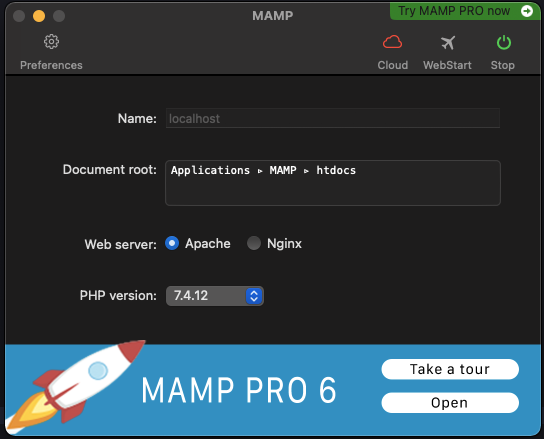
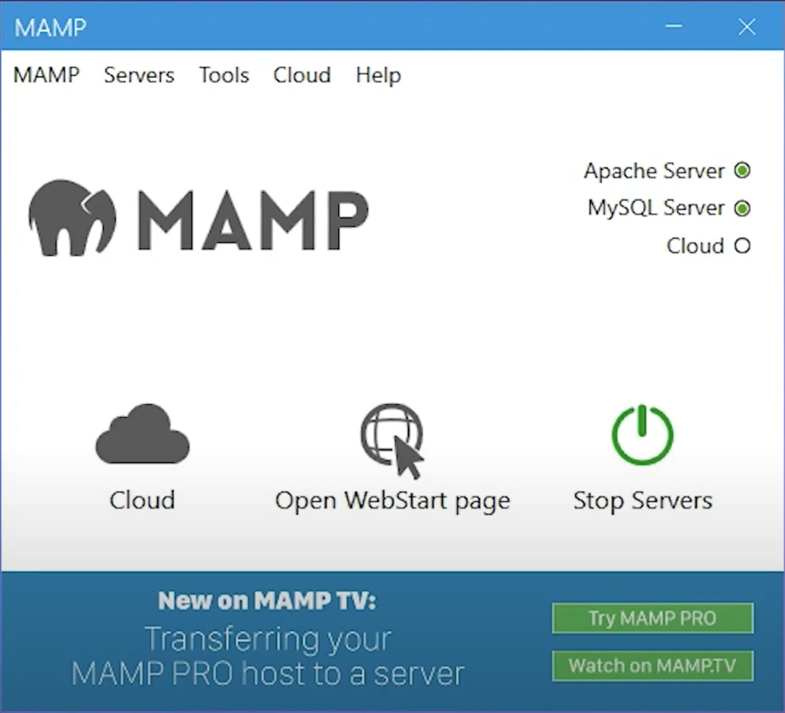
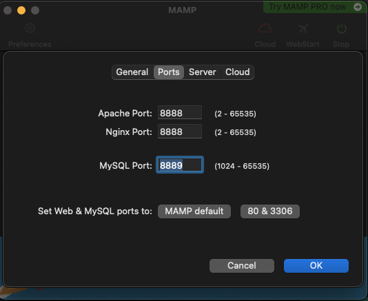
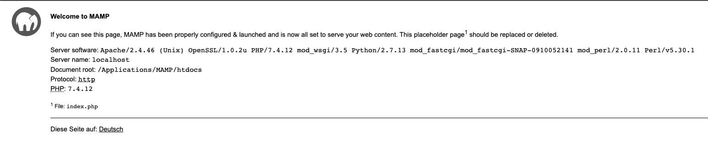

# HTML intégration

## Le but ?
L'idée d'utiliser le php dans le monde du webdev est de dynamiser les pages `HTML`

par exemple afficher les informations de l'utilisateur (Nom, prénom,...) directement dans l'affichage des pages du site


### Installation de notre serveur php

Pour lire des fichiers `fichier.php` nous allons avoir besoin d'un serveur php de type [Apache](https://fr.wikipedia.org/wiki/Apache_HTTP_Server), nous allons pour ça utiliser MAMP

##### Se rendre sur [https://www.mamp.info/en/downloads/](https://www.mamp.info/en/downloads/)


<details>
	
  <summary>Téléchargement</summary>

  #### Mac

  ##### si vous êtes sur M1 / M2 
  prendre 'MAMP & MAMP PRO 6.6 (M1)'

  ##### si vous êtes sur Intel
  prendre 'MAMP & MAMP PRO 6.6 (Intel)'

  ---
  **NOTE**

  Si vous ne savez pas: se rendre dans le menu 'pomme' puis 'a propos de ce mac' regarder section 'processeur'

  ---

  #### Windows
  prendre 'MAMP & MAMP PRO 5.0.5'
</details>
<details>
  <summary>Utilisation</summary>
  #### De quoi ça a l'aire ? 

  Vous pouvez appuyer sur "Start" 

  ---
  **NOTE**
  Ne pas utiliser la version 'pro'
  ---

  
  


  ### Dans l'onglet 'préférence'
  vous retrouverez 2 sections importante `Ports` et `Server`

  #### Ports
  

  ici vous retrouverez les information sur les ports 
  <ol>
    <li>Apache port: le port sur le quel votre application va tourner</li>
    <li>MySql port: le port sur le quel votre base de données va tourner</li>
  </ol>

  pour accéder a votre première application il vous faudra donc vous rendre sur votre navigateur préféré entrer [http://localhost:8888/](http://localhost:8888/)
  vous devrier arriver sur une page de présentation
  
</details>


### Votre première page PHP
  
[php.net](https://www.php.net/manual/fr/tutorial.firstpage.php)

Créez un fichier appelé `bonjour.php` dans votre dossier web racine (`DOCUMENT_ROOT`) avec le contenu suivant :

```php
<?php
  <html>
    <head>
      <title>Test PHP</title>
    </head>
    <body>
      <?php echo '<p>Bonjour le monde</p>'; ?>
    </body>
  </html>
?>
```

```html

<html>
 <head>
  <title>Test PHP</title>
 </head>
 <body>
 <p>Bonjour le monde</p>
 </body>
</html>
```
