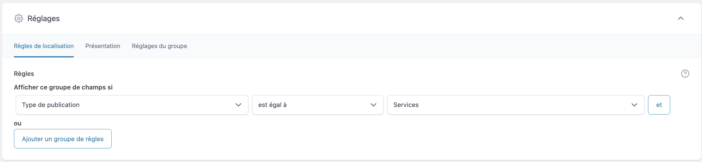
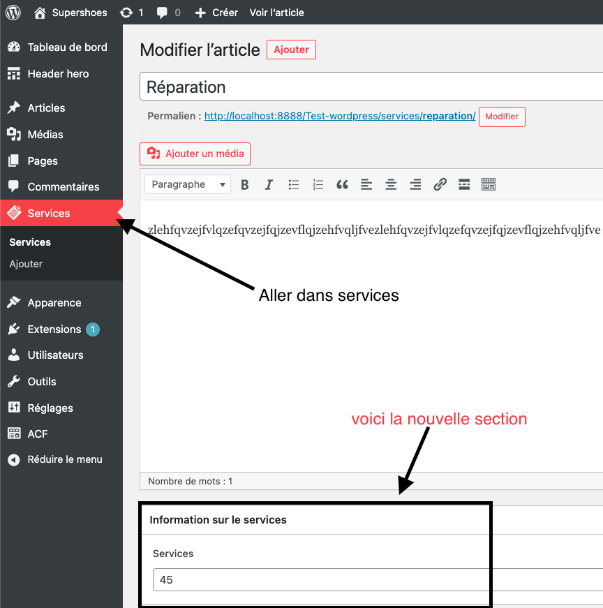

# Advanced Custom post type

[Voir Github Version](https://github.com/Poulycroc/lessons-isfsc/blob/master/courses/10__advanced_custom_post_type.md)<br>

## C'est quoi ? 

[ACF (Advanced Custom Fields)](https://www.advancedcustomfields.com/) est une extension pour WordPress qui vous permet de créer des champs personnalisés pour vos publications, pages et autres types de contenu sur votre site WordPress. Cela signifie que vous pouvez ajouter des champs supplémentaires à vos formulaires de publication pour stocker des données spécifiques que vous souhaitez afficher sur votre site, comme des informations de contact, des images ou des vidéos.

Une fois que vous avez installé et activé l'extension ACF, vous pouvez créer des champs personnalisés en allant dans l'administration de votre site WordPress et en naviguant jusqu'à "Personnaliser". Là, vous verrez une option pour "Champs personnalisés", où vous pourrez créer de nouveaux champs en sélectionnant le type de champ que vous souhaitez utiliser (texte, nombre, image, etc.), en donnant un nom au champ et en le configurant selon vos préférences.

Une fois que vos champs personnalisés sont créés, vous pouvez les ajouter à vos formulaires de publication en utilisant l'éditeur de contenu de WordPress. Vous verrez alors les champs supplémentaires que vous avez créés, ce qui vous permettra de saisir les données que vous souhaitez enregistrer pour chaque publication.

Lorsque vous affichez votre contenu sur votre site WordPress, vous pouvez utiliser les fonctions de l'extension ACF pour afficher les données des champs personnalisés que vous avez créés. Cela vous permet de personnaliser l'apparence et le contenu de votre site en fonction de vos besoins et de ce que vos visiteurs souhaitent voir.

En résumé, ACF vous permet de créer des champs personnalisés pour votre site WordPress et de les utiliser pour stocker et afficher des données spécifiques. Cela vous offre une grande flexibilité et vous permet de personnaliser l'apparence et le contenu de votre site pour le rendre unique et adapté à vos besoins.

## Comment ça marche

[source vidéo](https://www.youtube.com/watch?v=rMYMmW6jjDg&t=271s)<br>
[source écrite](https://kinsta.com/fr/blog/advanced-custom-fields/)


<details>
<summary>Installation</summary>

1. On se rend comme toujours (quand on veut installer un 'plugin' ou un 'extention') dans `extentions`.<br>

2. On se rend dans la section Ajouter.<br>

3. On cherche l'extention `ACF`.<br>
4. Une fois trouvé on clique sur "Installer".<br>

5. On active le `plugin`.<br>


</details>
<br>

### Utilisation

On peut maintenant se rendre dans l'écran `ACF`<br>
<br>
Dans cet écran on va donc pouvoir créer des `groupes de champs`.<br>
<br>
dans ce cas ci je vais ajouter un `groupe de champs` pour les services... Dans ce contexte j'ai envie d'ajouter quelque infos sur les services que je propose à mes possible clients.<br>
<br>
Je vais donc ajouter un `champ`.<br>
<br> 
Dans l'exemple que je propose ici, il se normera '`Services`' et sera en type `number`, (évidement `services` sans majuscules ni auter pour le coté code), on peut aussi noter que je précise a mon future utilisateur que l'unité de mon champ `services` est en `euro`, une fois mon champ créé je vais devoir lier le `groupe de champs` à un type de publication, dans l'exemple ici je vais le lier a mes `Custom post type` de type `services`.<br><br>Quand je vais me rendre dans le `type de publications` qui a été lié a ce fameux `groupe de champs` je vais me retrouver avec une nouvelle section dans ma page de modification.<br><br>Pour afficher la nouvelle valeur que j'ai entré dans mon `custom field` je vais simplement ajouter dans la boucle de mon type post lié.
```php
<?php echo get_field('services'); ?>
```

Par exemple dans la boucle qui me permettait d'afficher les services du cordonnier je vais pouvoir ajouter `get_field('services')` par exemple juste en dessous du `the_content()`.
```php
<?php
  $services = new WP_Query([ 
    'post_type' => 'services',
    'post_status' => 'publish',
    'limit' => 3, 
    'orderby' => 'date',
    'date' => true 
  ]);

  if ($services->have_posts()): 
?>
  <div class="row">
    <?php 
      while ($services->have_posts()): 
      $services->the_post(); 
    ?>
      <div class="col-sm">
        <div class="card">
          " 
            class="card-img-top"
            alt="<?php the_title() ?> | service | <?php echo bloginfo('name'); ?>" 
          >
          <div class="card-body">
            <h3 class="card-title h5"><?php the_title(); ?></h3> 
            <p class="card-text"><?php the_content(); ?></p> 

            <span class="prix"><?php echo get_field('prix'); ?></span>
            
          </div>
        </div>
      </div>
    <?php endwhile; ?>
  </div>
<?php else: ?>
  <h5>On a pas encore de services a vous proposer mais ça arrive !</h5>
<?php endif; ?>
```

[plus d'exemples de code](https://www.advancedcustomfields.com/resources/code-examples/)