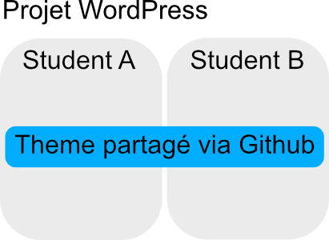
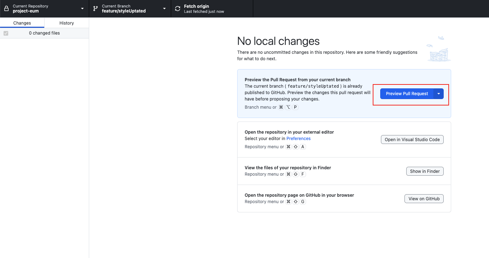
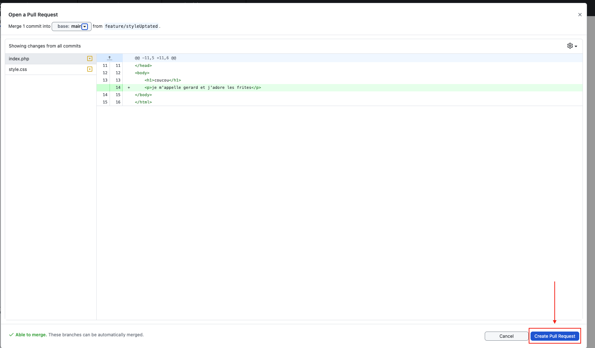
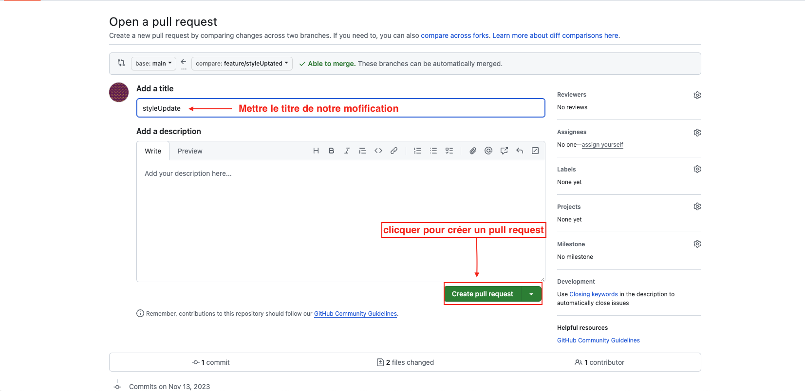
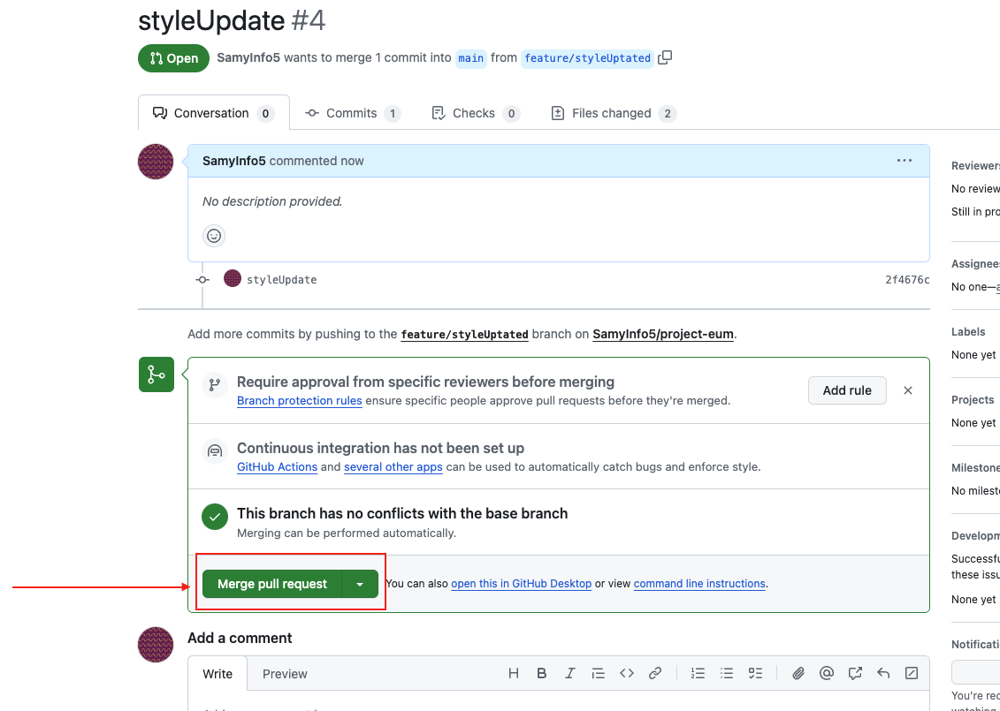

# Bien travailler en binôme sur WrodPress

Comme vous le savez l'idée du projet est de travailler en groupe, pour ce faire on va utiliser plusier outils comme [WordPress](https://wordpress.org) et [GitHub](https://github.com)

## Avant de commencer..

1. Bien définir les espaces de travail, chacun des membres du binôme auront leur propre `WordPress` en local (sur leur machine) les seul fichiers qui seront partagé dans via `GitHub` seront les fichiers du `Theme` de votre projet.
2. Une fois le projet prêt à être mis en ligne, nous migrerons le projet sur le serveur dédié à cet effet, ce que nous verrons dans [le module suivant](#).

## Commençons

### 1. Création du repository
Je vais commencer par créer un nouveau dépôt dans mon espace GitHub (un seul membre du groupe devra le faire pour ensuite partager le dépôt avec le reste des membres du groupe).

Création du repo sur GitHub

1. En haut a droite sur le site [GitHub](https://github.com), cliquez sur votre profil. 
2. Allez dans "profile" 
3. Allez dans "repositories" 
4. Cliquez sur "New" pour ajouter un nouveau dépôt. 
5. On fait attention a avoir un nom claire, penser a selectionner priver, on devrait être bon 
6. Vous devrier arriver sur cet écran 

### 2. On ajoute notre collaborateur

Ajouter votre partenaire

1. Ajoutez un collaborateur dans les paramètres du dépôt. 
2. On continue 
3. On filtre pour trouver notre ami 
4. On attend sa réponse 

> [!IMPORTANT]
> On pense évidement a ajouter nos professeur préféré [Grégoire Holvoet](https://github.com/gregholvoet) et [Maxime Bartier](https://github.com/Poulycroc).

### 3. Creation de notre WordPress

On va devoir télécharger une version de [WordPress](https://wordpress.org/download/) si ce n'est pas encore fait, ensuite on aura simplement a récupérer le projet directement depuis GitHub

Lier avec GitHub

<ol>
<li>
  On va commencer par créer un nouveau WordPress dans notre dossier `MAMP/htdocs` comme d'habitude 
</li>
<li>Avec l'application <a href="https://desktop.github.com/">GitHubDesktop</a> on va récupérer le `repository` qu'on a créé sur <a href="https://github.com/">GitHub</a>
    <ul>
      <li>Dans le coin supérieur gauche on peut changer de projet  </li>
      <li>On voit une liste de projet sur les quel on travail l'idée c'est d'en ajouter un nouveau </li>
      <li>Pour ça on va "cloner" le projet de puis notre GitHub </li>
      <li>On peut choisir le projet qui nous intéresse </li>
      <li>On va devoir choisir l'emplacement du projet sur notre machine </li>
      <li>Je choisi évidement placer le projet dans mon dossier "MAMP/htdocs/project-eum" et évidement ce qui nous intéresse c'est juste le partage du theme avec notre partenaire de travail on continue dans "wp-content/themes" </li>
      <li>Je devrais me retrouver avec quelque chose comme ça </li>
  <ul>
</li>
</ol>

3. Voila notre projet est bien lié entre notre machine et notre compte Github 
4. je vais pouvoir écire mes premières ligne de code 

### 4. Un peu de code

On va just faire quelque fichiers dans un premier temps histoire de pouvoir voir ce que ça donne

Publication de nos premiers bouts de codes

1. Je crée donc mes deux premiers fichier (je vous invite évidement a consulter les cours si vous ne savez toujours pas de quoi parle ici) 
2. Sur mon GitHubDesktop je vois que j'ai bien les changements qui sont visiblent 
3. je commit mes premiers changements 
4. Je vais pouvoir choisir dans quel branche faire mes "ajouts" 
5. Je choisi de créer une nouvelle branche pour plus de propreté dans mon travail (j'explique un peu plus en détail comment ça marche) 
6. je publie  
7. on va pouvoir publier aussi sur la branche `main` histoire d'avoir plus facile pour la suite

### 5. Pourquoi avoir plusieurs branches ?

Pour travailler de la manière la plus propre possible on va en générale travailler sur `3 branches` comme dans cette image.

On aura moins de problère, dans le cas d'une perte ou d'une destruction de notre projet on pourra facielement revenir en arrière.

1. La branche `main` ou `master` sera notre branche "final" celle qu'on aura envie de montrer au grand jour a priori on ne va jamais directement toucher a cette dernière car ça sera la version la plus "stable" de notre site ou application
2. La branche `develop` sera la branche de "travail" c'est sur cette branche la qu'on va faire le plus gros du travail elle ne sera pas stable et donnera un apperçu de l'avancement du projet.
3. Les différence `features` ou modification auront en gérérale leur propre petite branche, sur les quel on pourra travailler de manière saine et propre sans casser le travail de notre binôme

### Préparation de nos branches de travail avec GitHub Desktop

1. **Lancer GitHub Desktop** et ouvrez le dépôt local correspondant à votre projet WordPress.
2. **Aller à la branche principale** : En haut de l'application, vous verrez un menu déroulant qui indique la branche sur laquelle vous êtes actuellement. Assurez-vous que c'est `main` ou `master` (cela dépend de la nomenclature que vous avez choisie pour votre branche principale).
3. **Créer une nouvelle branche** : Cliquez sur le menu déroulant des branches, puis sur le bouton `New Branch` à côté de la liste déroulante des branches.
4. **Nommer votre branche** : Dans la fenêtre qui s'ouvre, entrez `develop` comme nom de la nouvelle branche.
5. **Basculer sur la nouvelle branche** : GitHub Desktop vous amène automatiquement sur cette nouvelle branche une fois qu'elle est créée.
6. **Publier la branche** : Si c'est la première fois que vous créez cette branche, vous devrez la publier sur GitHub pour que les autres puissent la voir. Cliquez sur le bouton `Publish branch` situé dans la barre en haut de GitHub Desktop.

#### Créer une branche de fonctionnalité (`feature`)

Le processus est similaire à la création de la branche de développement :

1. Assurez-vous que vous êtes sur la branche à partir de laquelle vous voulez dériver votre branche de fonctionnalité. Habituellement, cela sera la branche `develop`.
2. Suivez les mêmes étapes que pour la création de la branche `develop`, mais cette fois, nommez votre branche en fonction de la fonctionnalité que vous êtes en train de développer, par exemple `feature/add-contact-form`.
3. Une fois que vous avez nommé et créé la branche, n'oubliez pas de la publier en cliquant sur `Publish branch` si vous souhaitez qu'elle apparaisse sur le dépôt distant sur GitHub.

#### Travailler avec les branches

Lorsque vous commencez à travailler sur votre branche de fonctionnalité, tous les commits que vous effectuez seront sur cette branche. Vous pouvez passer d'une branche à une autre en utilisant le menu déroulant des branches.

#### Fusionner les branches (Pull Request)

Une fois que vous avez terminé le travail sur une branche de fonctionnalité, vous pouvez demander à la fusionner avec la branche `develop` :

1. Sur GitHub Desktop, assurez-vous que tous vos changements sont commités.
2. Passez à la branche `develop`.
3. Cliquez sur `Branch` dans le menu en haut, puis sélectionnez `Merge into Current Branch...`.
4. Sélectionnez la branche de fonctionnalité que vous souhaitez fusionner.
5. Cliquez sur `Merge`.

Exemple Pull Request 

1. Allez sur la branche que vous voulez 'commit' et appuyer sur `preview pull request` 

2. Vous allez voir les changement faites sur la branche, selectionner en haut a gauche  la branche vers laquelle vous voulez que la branche se fussionne et ensuite vous pouvez cliquer sur `Create Pull Request`. 

3. Vous allez être rediriger vers le site de GitHub avec un "formulaire" avec le titre de votre commit. Vous pouvez toujours vérifier sur quel branche vous voulez commit votre changement juste au dessus de add a title. 

4. Pour finir ceci va vous rediriger vers la fin ou vous n'aurez plus qu'a appuyer sur `Merge pull request` et ensuite une fois une mini verification appuyer sur `merge` ce qui va merger fussioner votre branche avec celle demander. 

Pour les Pull Requests, qui sont des demandes de fusion sur le dépôt distant (GitHub en ligne), vous devrez utiliser le site web GitHub pour les créer et les gérer. Ce processus permet une revue de code par vos pairs avant que les changements ne soient intégrés à la branche principale.

#### Conseil Important

- **Communiquez avec votre équipe** : Avant de fusionner des branches ou de pousser de gros changements, communiquez avec votre binôme pour vous assurer que vous êtes synchronisés.

En utilisant cette méthode, vous pouvez gérer vos branches et veiller à ce que votre développement soit organisé et que les contributions de chacun soient intégrées de manière fluide et contrôlée dans le projet global.

### Exemple concrèt pour l'ajout d'un style css
Dans GitHub Desktop, basculez sur la branche `develop`, créez une nouvelle branche `feature/style-update`. Ouvrez votre fichier CSS, apportez les modifications de style souhaitées. Committez vos changements avec un message descriptif, poussez sur GitHub. Ouvrez une Pull Request pour fusionner `feature/style-update` dans `develop`.

## Explications complémentaires:

- **GitHub Desktop** : C'est une interface graphique pour gérer vos dépôts GitHub sans utiliser la ligne de commande. Très pratique pour les débutants ou ceux qui préfèrent une interface visuelle.
- **WordPress en local** : Installer WordPress localement signifie que vous le faites fonctionner sur votre ordinateur, comme si c'était un serveur, mais accessible uniquement par vous. Cela permet un développement et des tests plus rapides.
- **Branches Git** : Les branches sont utilisées pour développer des fonctionnalités isolément les unes des autres. La branche main est la branche par défaut où l'état final du code est stocké.
