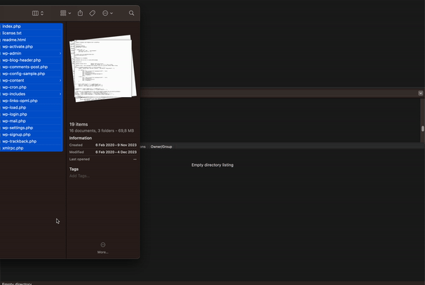
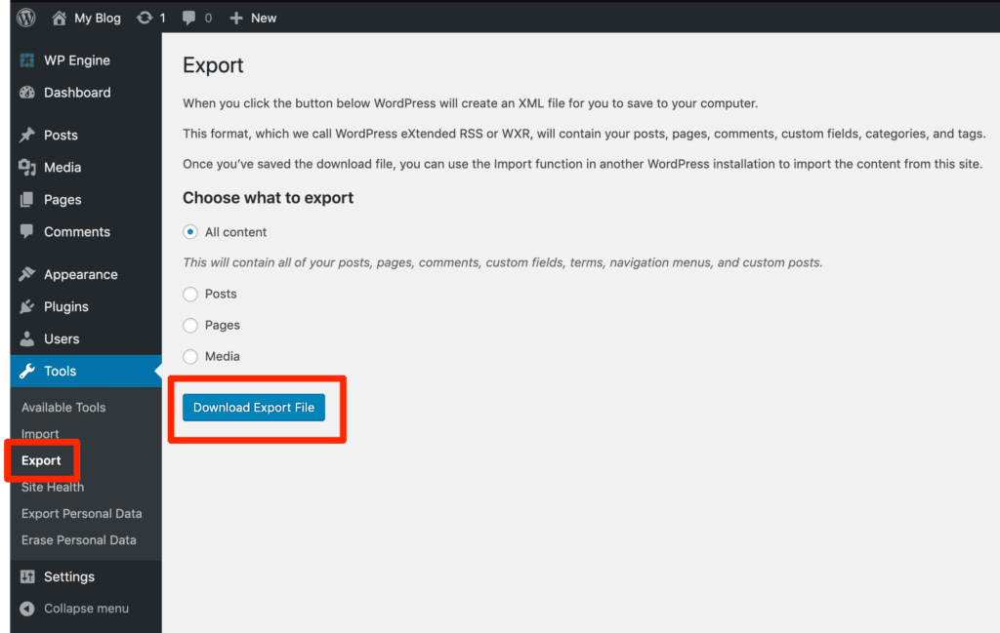
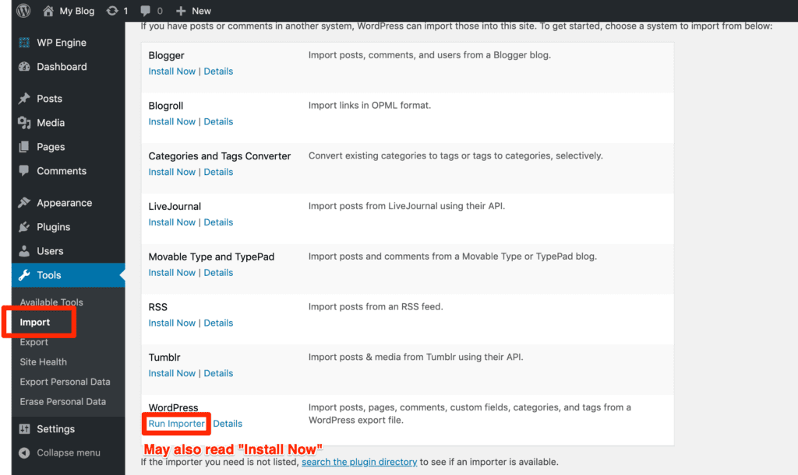
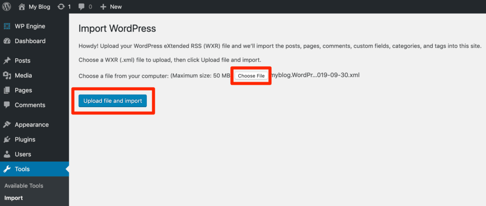
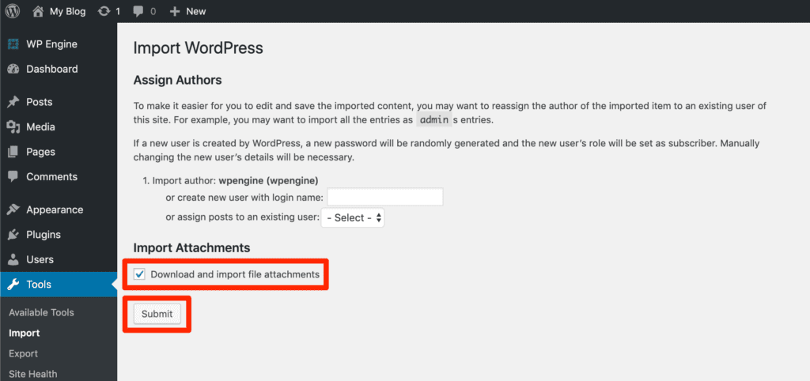

# Mise en ligne d'un projet WordPress

## Télécharger notre outil de mise en ligne
On va se rendre sur [FileZilla](https://filezilla-project.org) et télécharger le `client`   

### Connexion sur notre serveur
1. Une fois notre installation terminée je vais pouvoir me connecter à mon serveur, pour ça rien de plus simple je vais me rendre dans l'outil de gestion de site  
2. Dans mon outil de gestion de site je vais donc pouvoir ajouter un nouveau site... 
3. dans le formulaire de connection je vais faire attention a bien choisir `SFTP` et remplir selon [les informations](https://isfsc365.sharepoint.com/:x:/r/sites/2EU1JProjetDigital2/_layouts/15/Doc.aspx?sourcedoc=%7B96BF338D-6B2E-4D44-BAF9-4E9BC2C46FDE%7D&file=Github%20students.xlsx&action=default&mobileredirect=true&DefaultItemOpen=1) que l'on ma fourni pour la connection 
4. je devrais arriver sur cet écran 
5. dans l'arborescence du serveur je vais pouvoir naviger jusqu'au dessier qui m'intéresse (dans mon cas c'est [demo.emu.isfsc.be](demo.emu.isfsc.be) mon url de projet) donc je vais chercher un dossier `demo` dans le dossier `home`   pour en suite arriver dans `www` qui est donc l'endroit ou je mettrais mon projet **WordPress**

### Mise en place de WordPress
1. On va télécharger une nouvelle version de **WordPress** juste pour notre serveur (donc sur [wordpress.org](https://wordpress.org/download/) on commence a avoir l'habitude...)
2. Une fois notre **WordPress** téléchargé on va pouvoir le mettre dans notre `arborescence serveur` sur **FileZilla** 

### Installation de wordpress

Si on se rend sur notre site (dans mon cas [demo.emu.isfsc.be](demo.emu.isfsc.be)) je devrais avoir ça 

1. Ici on va évidement devoir entrer les information que l'on nous donne [ici](https://isfsc365.sharepoint.com/:x:/r/sites/2EU1JProjetDigital2/_layouts/15/Doc.aspx?sourcedoc=%7B96BF338D-6B2E-4D44-BAF9-4E9BC2C46FDE%7D&file=Github%20students.xlsx&action=default&mobileredirect=true&DefaultItemOpen=1) 

---

# On a maintenant 2 solutions pour que notre travail se retrouve sur le serveur

## Solution 1: **Mise a jour continue**

Voir plus

### Ajout de notre theme dans le **WordPress** en ligne

Dans **FileZilla** je vais pouvoir me diriger vers le dossier qui m'intéresse (dans mon cas `demo`)  une foi que je suis au niveau des themes WordPress je vias pouvoir y glisser le theme sur le quel j'ai travaillé avec mon binome  une foi le transfère terminé je vais pouvoir le retrouver dans mon `backoffice` **WordPress** et donc pouvoir activer le theme 

### Que faire après une modification ? 

Imaginons je fais un changement sur ma page d'accueil  
après avoir partagé la modification avec mon bonome via **Github** je vais pouvoir simplement glisser le fichier conserner dans **FileZilla** comme j'ai pu le faire pour ajouter le theme.

dans le cas ou j'ai donc modifier le fichier `index.php` je vais simplement pouvoir le glisser directement dans le **FileZilla**   je peux aussi directement naviger et remplacer les fichier depuis **FileZilla**  

> [!IMPORTANT]  
> C'est une technique facile et qui marche bien mais il faut bien faire attention au fait que toute modification sur le serveur via **FileZilla** entraine la suppression du fichier conserner, il est donc important de bien se coordoner avec notre équipier pour éviter tout remplacement qui pourrait faire perdre l'avancement du travail

### Exporter / importer les données de notre base de données

1. Connectez-vous à l'administration de WordPress (wp-admin) du site source.
2. Placez le curseur sur l'option "Outils".
3. Cliquez sur "Exporter".
4. Choisissez ce que vous voulez exporter. Si vous exportez uniquement des articles, gardez à l'esprit que les images à la une ne seront pas transférées et devront être importées manuellement à nouveau sur le site de destination.
5. Cliquez sur "Télécharger le fichier d'exportation". 

**Importation du contenu**

Le contenu doit être exporté correctement avant de pouvoir être importé. Le fichier d'exportation doit être téléchargé de l'étape précédente avant de commencer.

Assurez-vous de réaliser cette étape sur le site de destination, où le contenu doit être copié.

1. Connectez-vous au tableau de bord d'administration de WordPress (wp-admin) du site de destination.
2. Placez le curseur sur l'option "Outils".
3. Cliquez sur "Importer".
4. Cliquez sur "WordPress".
5. Cliquez sur "Installer maintenant" et/ou "Exécuter l'importateur". Si l'importateur WordPress n'est pas installé, une invite s'affichera pour installer le plugin. 
6. Parcourez l'ordinateur pour le fichier XML exporté du site source et sélectionnez-le.
7. Cliquez sur **Téléverser le fichier et importer**. 
8. Sélectionnez le nom de l'utilisateur auteur qui se verra attribuer les articles et les pages.
9. (Facultatif) **Téléchargez et importez les pièces jointes des fichiers**. Cochez cette case pour importer les photos et autres fichiers médias attachés à l'article.
10. Cliquez sur "Soumettre". 

## Solution 2: **La migration**

Voir plus

### Syncroniser le le serveur pour qu'il ressemble comme 2 goutes d'eau a notre projet en local

1. Aller dans `plugins` (`extentions` en français) 
2. `Add plugin` 
3. Installer [All-in-One WP Migration](https://fr.wordpress.org/plugins/all-in-one-wp-migration/)  
4. On pense a activer le plugin  On devrait avoir un nouveau menu sur la gauche 

##### Ca sert a quoi ?
Ce plugin va nous permettre de syncroniser 2 **WordPress** stocké a 2 endroits différents, transférer notre **WordPress** `local` vers le `serveur`

pour que ça fonctionne on va avoir besoin de répéter l'opération sur notre **WordPress** `local` je me rend donc sur le projet que je veux cloner sur le serveur

1. récupérer depuis `MAMP` 
2. le projet qui m'intéresse ici c'est `SuperShoes` 
3. je me rend donc sur le bon `url` (dans mon cas -> [http://localhost:8888/supershoes/](http://localhost:8888/supershoes/)) 
4. Le résultat que je veux donc copier 
5. Je me connecte a mon admin si c'est n'est pas encore fait 
6. Installer le même [plugin](https://fr.wordpress.org/plugins/all-in-one-wp-migration/) dans notre instance **WordPress Local** 

#### Exportation -> Importation

#### Exportation

1. On va aller dans notre plugin `All-in-One WP Migration` et simplement **exporter**  
2. On va choisir `File`  
3. Une foi notre exportation faite on va pouvoir la télécharger 
4. Une foi télécharger on va pouvoir se rentre sur notre site **WordPress** en ligne (dans mon cas [demo.emu.isfsc.be](demo.emu.isfsc.be))

#### Importation

1. On fait évidement bien attention, on doit être sur notre projet en ligne (dans mon cas [demo.emu.isfsc.be](demo.emu.isfsc.be))
2. On va aller dans notre plugin `All-in-One WP Migration` et se rendre dans la section `Import`  
3. je vais donc cliquer sur `IMPORT FROM` pour récupérer le fichier que j'ai exporté de mon **WordPress Local**  
4. je choisi mon fichier  
5. comme l'indique le carton ici ça va éffacer et remplacer le **WordPress En ligne**  
6. après confirmation on nous indique que tous s'est bien passé  
7. on va être redirigé vers une page de connection -> la je vais devoir me connecter avec les identifiant que j'ai utilisé pour installer mon **WordPress** en local 

